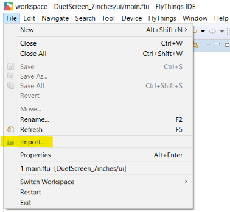
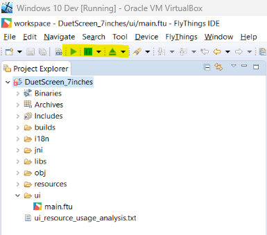
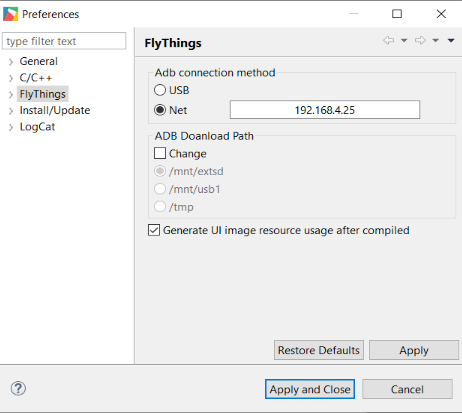
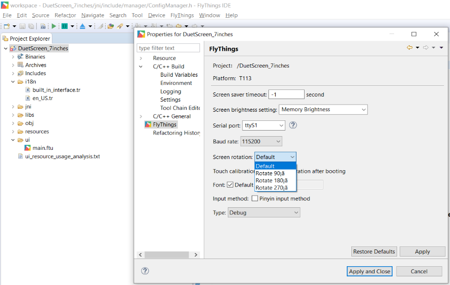
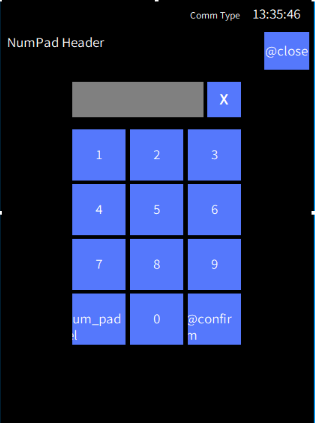
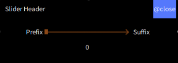
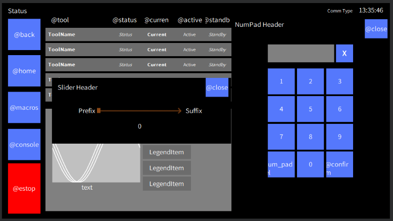
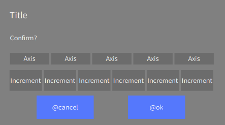
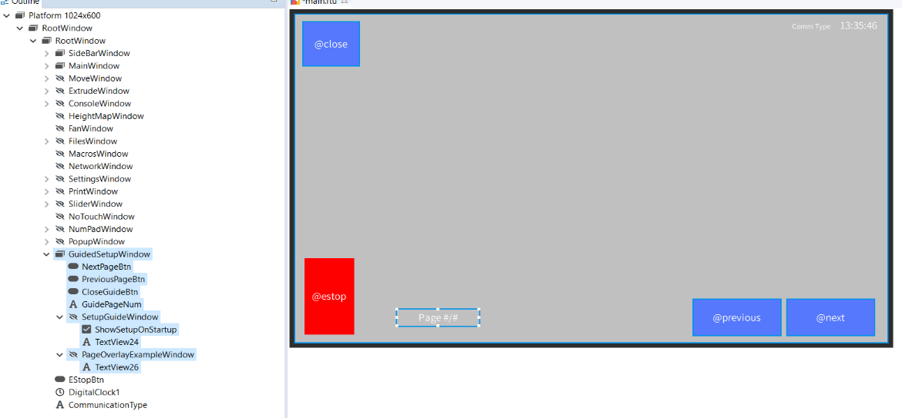
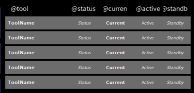

# DuetScreen

This firmware provides a graphical user interface to control a Duet3D control board running RRF3.5 or later in standalone mode.

- [DuetScreen](#duetscreen)
  - [Upgrading](#upgrading)
    - [Network](#network)
    - [USB](#usb)
    - [Fallback](#fallback)
  - [Usage](#usage)
    - [Changing Communication Mode](#changing-communication-mode)
    - [Connecting to a Network](#connecting-to-a-network)
    - [Touch Calibration](#touch-calibration)
    - [Starting a Guide](#starting-a-guide)
    - [Changing Theme](#changing-theme)
    - [Changing Language](#changing-language)
    - [Adding a webcam](#adding-a-webcam)
  - [Developer Documentation](#developer-documentation)
    - [Setup](#setup)
      - [Visual Studio Code](#visual-studio-code)
    - [Folder Structure](#folder-structure)
    - [Compiling](#compiling)
      - [Inverting Display](#inverting-display)
    - [Debugging](#debugging)
    - [Modifying GUI](#modifying-gui)
      - [UI Element Types](#ui-element-types)
      - [Themes](#themes)
        - [Theme Override Functions](#theme-override-functions)
      - [Reusable Components](#reusable-components)
      - [Add New Language](#add-new-language)
    - [Modify Logic](#modify-logic)
      - [Windows / Overlays](#windows--overlays)
      - [Accessing GUI Elements](#accessing-gui-elements)
      - [Using Object Model Information](#using-object-model-information)


## Upgrading

### Network

> [!NOTE]
> This only works if the screen is connected to the Duet via network.

* Upload the `DuetScreen.bin` file to the `/firmware` directory on the Duet.
  * Currently there is no support in RRF to update the screen automatically from the Duet. When DWC asks if you would like to upgrade, select `No`.
* From the screen, navigate to `Settings` -> `Update`

### USB

* Copy the `DuetScreen.bin` file onto a USB stick.
* Insert the USB stick into the screen.
* The screen will prompt you to upgrade the firmware.
* Press the `Upgrade` button to start the upgrade process.
* If you decline the upgrade, the screen will not automatically prompt you again for that firmware version. To upgrade, you must navigate to the `Files` window, select `USB Files` and select the firmware file to upgrade from.

### Fallback

If the firmware becomes corrupted or it is not prompting you to upgrade, rename the file from `DuetScreen.bin` to `upgrade.img` and repeat the progress.
* If this file is found then the screen will continually prompt you to upgrade the firmware even if the upgrade completes successfully.
* Make sure to remove the USB stick once the upgrade is complete to prevent this from happening. 

## Usage

### Changing Communication Mode

* Go to `Settings` -> `Duet`

Currently the screen supports the following communication modes:
* `UART`: The screen will connect to the Duet via the UART1 port.
  * Configure the baud rate on the Duet to match the screen.
  * `M575 P1 S0 B115200`
* `Network`: The screen will connect to the Duet via the network, this is the same as DWC.
  * The screen must be connected to the same network as the Duet. [Connecting to a Network](#connecting-to-a-network)
  * The Duet has a built in limit for how many connections can be made handled at once in standalone mode.
    If you are seeing connection issues, it may be because the Duet is ignoring some of the requests.

### Connecting to a Network

* Go to `Network`
* Select the network you would like to connect to.
* Enter the password for the network.

### Touch Calibration

* Go to `Settings` -> `Touch Calibration`

### Starting a Guide

There are various guides that can be shown to the user to help them understand how to use the printer or the screen.

* To start a guide, go to `Settings` -> `Guides` and select the guide you would like to start.

### Changing Theme

* Go to `Settings` -> `Theme` and select the theme you would like to apply.

To create a new theme, see the [Developer Documentation](#themes).

### Changing Language

* Go to `Settings` -> `Language`

### Adding a webcam

* Go to `Settings` -> `Webcam`
* Enter the URL of the webcam stream.
  * The URL must return a `.png`, or `.jpeg` image.
  * The URL will be polled every 0.5 seconds by default.

## Developer Documentation

The screen is developed in C++ using the Flythings SDK to provide a GUI framework. All the logic is contained in `src/jni/` with the GUI defined in `src/ui/main.ftu`.

Flythings provides a *What You See Is What You Get* (WYSIWYG) way of creating and modifying the GUI. This requires the use of the [Flythings IDE](https://developer.flythings.cn/zh-hans/download.html).

Flythings has some documentation on the SDK, it is split between a more up-to-date Chinese version and an older English version. The English version is still useful for understanding the basics of the SDK, but the Chinese version is more up-to-date and has more information.
* https://developer.flythings.cn/zh-hans/system_introdoction.html
* https://developer.flythings.cn/en/system_introdoction.html

### Setup

> [!WARNING]
>
> It is advised to use a virtual machine for development.

* Install Flythings IDE
  * [Environmental Installation · FlyThings Docs](https://developer.flythings.cn/zh-hans/download.html)
* Download the `T113` SDK folder
  * https://download.flythings.cn/sdk/platforms/t113.7z
* Extract the `T113` SDK folder to `C:/flythings/sdk/platforms/`
* Clone/download the `DuetScreen` repository
* Open Flythings IDE
* `Import` Flythings project
  * 

#### Visual Studio Code

The project has also been setup to allow editing in Visual Studio Code. This also provides a much more complete autoformatter using clang-format.
* Extract the `T113` SDK folder in the same parent directory as the project folder. 
* Install the `C/C++` extension.

> [!NOTE]
> You will still need to use Flythings IDE to modify the `.ftu` file and generate the `.img` file. It is possible to run the Makefile from the command line to compile the project, but Flythings IDE is required to convert the `.so` library to a `.img` file.


### Folder Structure

* All the logic is contained in the [src/jni/](src/jni) folder.
* Flythings IDE will automatically generate some code in the [activity](src/jni/activity/) and [logic](src/jni/logic/) folders.


| Folder                                        | Description                                                                                                                                  |
| --------------------------------------------- | -------------------------------------------------------------------------------------------------------------------------------------------- |
| [src/i18n](src/i18n)                          | Language files                                                                                                                               |
| [src/jni/activity](src/jni/activity/)         | Generated by Flythings IDE. **DO NOT MODIFY**                                                                                                |
| [src/jni/comm](src/jni/comm/)                 | Code involved in communication                                                                                                               |
| [src/jni/Hardware](src/jni/Hardware/)         | Code for interacting with specific hardware                                                                                                  |
| [src/jni/include](src/jni/include/)           | Header files for Flythings and generic libraries                                                                                             |
| [src/jni/logic](src/jni/logic/)               | Generated by Flythings IDE. When you add a GUI element, the asscoiated functions to control it will be added here.                           |
| [src/jni/ObjectModel](src/jni/ObjectModel/)   | Code for maintaining a local copy of the Duet Object Model                                                                                   |
| [src/jni/uart](src/jni/uart/)                 | Code for interacting with the UART                                                                                                           |
| [src/jni/UI](src/jni/UI/)                     | Code for setting the GUI contents and responding to events                                                                                   |
| [src/jni/UI/Guides](src/jni/UI/Guides/)       | Location for any user guides / tutorials that can be displayed on the screen                                                                 |
| [src/jni/UI/Logic](src/jni/UI/Logic/)         | Code for the logic of the UI elements. This is to keep the `mainLogic.cc` file clean. Generally there is one file per main window of the GUI |
| [src/jni/UI/Observers](src/jni/UI/Observers/) | Code for observing the Duet Object Model and updating the GUI accordingly                                                                    |
| [src/jni/UI/Themes](src/jni/UI/Themes/)       | Location for any themes that can be applied to the screen                                                                                    |
| [src/jni/upgrade](src/jni/upgrade/)           | Code for upgrading the firmware                                                                                                              |
| [src/jni/utils](src/jni/utils/)               | Utility functions that are used across the codebase                                                                                          |
| [src/resources](src/resources/)               | Any images or files that are needed by the code/GUI                                                                                          |
| [src/ui](src/ui/)                             | GUI files created using Flythings IDE                                                                                                        |

### Compiling

* 
  * The green play icon (left) will compile the project.
  * The blue eject icon (right) will compile the project and create an image file that can be used to flash the screen.
    * To convert the `upgrade.img` file to a `DuetScreen.bin` file, simply rename the file.
  * When developing code, it is possible to temporarily flash the screen by using `Ctrl+Alt+R` to compile the firmware and flash it to the screen.
    * You need to configure the ADB configuration in Flythings for this to work
    * 

#### Inverting Display

This needs to be done at compile time.
* Open the project properties.
* Change the `Screen rotation` setting in the `FlyThings` tab.
  * 

### Debugging

If you have Flythings installed then you can use the IDE to debug the screen.
* https://developer.flythings.cn/en/adb_debug.html

It is possible to debug the screen using `adb` from the command line without having to install the full Flythings IDE.
* Download the android SDK Platform-Tools from the following link:
  * https://developer.android.com/tools/releases/platform-tools
* Add the `platform-tools` folder to your system `PATH`
* Run a terminal and type `adb connect <ip_address_of_screen>`
  * You can find the IP address of the screen by going to `Network` -> `...`
* Start monitoring the logs with `adb logcat`
  * You can add the time with `adb logcat -v time`
  * You can filter by priority with `adb logcat -v time *:E` (error), `adb logcat -v time  *:W` (warning), `adb logcat -v time  *:I` (info), `adb logcat -v time  *:D` (debug), `adb logcat -v time  *:V` (verbose)
  * To you can chain multiple filters together
  * You can also pipe the output to `grep` to filter the output further.

To check the memory usage of the screen, you can use the `adb shell` command to connect to the screen and run the `top` command.

### Modifying GUI

To make fundamental changes to the GUI, you will need to use the Flythings IDE. This lets you move, add, delete UI elements, and set their properties. An overview of what UI elements are available can be found in the [Flythings documentation](https://developer.flythings.cn/en/ctrl_common.html).

> [!IMPORTANT]
> To interact with the UI elements in the code, you need to use the `ID` of the element. Ensure that any element you create has a unique and descriptive `ID` field.

After you have modified and saved the `main.ftu` file with your changes to the GUI, any element that has been added will not be added into the code until you compile the project.
* Flythings will automatically generate the relevant code to interact with the UI elements, this code is placed in the `activity` folder. **TAKE EXTREME CARE IF MODIFYING THE CONTENTS OF THE ACTIVITY FOLDER MANUALLY!**.
* Flythings will also add any control functions relevant to the UI element into `src/jni/logic/mainLogic.cc`. Details on these are described in the Flythings documentation.
  * To keep the `mainLogic.cc` file clean, the logic for the UI elements should be split into separate files located in the [src/jni/UI/Logic/](src/jni/UI/Logic/) folder.
* Flythings will **NOT** delete any code in `mainLogic.cc` for elements that have been removed from the GUI, you will need to manually remove these.

There are some parts of the UI for this screen that are more complex than a single UI element. Where possible these have be created in a way that allows them to be reused across the GUI. Some examples are the tools list, number pad, slider, popup, and guides.

#### UI Element Types

| Flythings Name | Type                         | How to get                                  | Description                                                                                                                                                     | Inherits     | Example                                          |
| -------------- | ---------------------------- | ------------------------------------------- | --------------------------------------------------------------------------------------------------------------------------------------------------------------- | ------------ | ------------------------------------------------ |
|                | `ZKBase*`                    | `UI::GetUIControl(int id);`                 | Base class                                                                                                                                                      |              |                                                  |
| Button         | `ZKButton*`                  | `UI::GetUIControl<ZKButton>(int id);`       | Run a callback when pressed. Can be set to various states.                                                                                                      | `ZKTextView` |  |
| Camera         | `ZKCameraView*`              | `UI::GetUIControl<ZKCameraView>(int id);`   | For displaying image from a local camera.                                                                                                                       | `ZKBase`     |                                                  |
| Checkbox       | `ZKCheckBox*`                | `UI::GetUIControl<ZKCheckBox>(int id);`     | Run a callback when toggled.                                                                                                                                    | `ZKButton`   |  |
| Circle Bar     | `ZKCircleBar*`               | `UI::GetUIControl<ZKCircleBar>(int id);`    | Display a background image and a foreground image. Foreground image is cropped at an angle relative to the starting angle based on current value.               | `ZKBase`     |                                                  |
| Diagram        | `ZKDiagram*`                 | `UI::GetUIControl<ZKDiagram>(int id);`      | A graph.                                                                                                                                                        | `ZKBase`     |                                                  |
| Digital Clock  | `ZKDigitalClock*`            | `UI::GetUIControl<ZKDigitalClock>(int id);` | A clock.                                                                                                                                                        | `ZKTextView` |                                                  |
| Edit Text      | `ZKEditText*`                | `UI::GetUIControl<ZKEditText>(int id);`     | Give user a keyboard or number pad for text input. Run a callback once user accepts input.                                                                      | `ZKTextView` |                                                  |
| List View      | `ZKListView*`                | `UI::GetUIControl<ZKListView>(int id);`     | Display a dynamic length list of items. The only UI element which allows for dynamic length at runtime. Can have subitems which are equivalent to a `ZKButton`. | `ZKBase`     |                                                  |
|                | `ZKListView::ZKListItem*`    |                                             | A item displayed in a list. No direct way to get.                                                                                                               | `ZKBase`     |                                                  |
| List Subitem   | `ZKListView::ZKListSubItem*` | `pListItem->findSubItemByID(int id);`       | Subitems are equivalent to a `ZKButton`.                                                                                                                        | `ZKButton`   |                                                  |
| Painter        | `ZKPainter*`                 | `UI::GetUIControl<ZKPainter>(int id);`      | A basic canvas that supports drawing primitive shapes.                                                                                                          | `ZKBase`     |                                                  |
| Pointer        | `ZKPointer*`                 | `UI::GetUIControl<ZKPointer>(int id);`      | Display a background image and a foreground image. Foreground image is rotated at an angle relative to the starting angle based on current value.               | `ZKBase`     |                                                  |
| QR Code        | `ZKQRCode*`                  | `UI::GetUIControl<ZKQRCode>(int id);`       | Display a QR code                                                                                                                                               | `ZKBase`     |                                                  |
| RadioGroup     | `ZKRadioGroup*`              | `UI::GetUIControl<ZKRadioGroup>(int id);`   | Multiple `ZKCheckBox` where only 1 can be selected.                                                                                                             | `ZKBase`     |                                                  |
| Seek Bar       | `ZKSeekBar*`                 | `UI::GetUIControl<ZKSeekBar>(int id);`      | A linear version of `ZKCircleBar`.                                                                                                                              | `ZKBase`     |                                                  |
|                | `ZKSlideText*`               | `UI::GetUIControl<ZKSlideText>(int id);`    | The contents of a `ZKSlideWindow`. Does not support theming.                                                                                                    | `ZKTextView` |                                                  |
| Slide Window   | `ZKSlideWindow*`             | `UI::GetUIControl<ZKSlideWindow>(int id);`  | A phone style app list. Does not support theming.                                                                                                               | `ZKWindow`   |                                                  |
| Text View      | `ZKTextView*`                | `UI::GetUIControl<ZKTextView>(int id);`     | Displays text.                                                                                                                                                  | `ZKBase`     |                                                  |
| Video View     | `ZKVideoView*`               | `UI::GetUIControl<ZKVideoView>(int id);`    | Displays a video.                                                                                                                                               | `ZKBase`     |                                                  |
| Window         | `ZKWindow*`                  | `UI::GetUIControl<ZKWindow>(int id);`       | A container for other UI elements.                                                                                                                              | `ZKBase`     |                                                  |

#### Themes

A theme can be created by adding a new `.cpp` in the [src/jni/UI/Themes](src/jni/UI/Themes/) folder. Each file contains a complete description of the theme.
* A theme works by setting the visual properties of all similar UI elements to a specific value. For example:
  * Setting the background color of all buttons to blue.
  * Setting the text color of all text views to white.
  * Setting the background image of all windows to a specific image.
* After the default properties have been set, the theme override method is run. This allows for specific elements to be changed to have different visual properties. For example:
  * The Emergency Stop button should be red.
  * Window overlays having a different background color.
* Because of the way `ZKListView` is rendered, any overrides have to be applied in a specific list override method
* Colors are in `0xARGB` format, where `A` is the alpha channel, `R` is the red channel, `G` is the green channel, and `B` is the blue channel.
* `NULL` can be used to remove the color from an element, for example, to make a window transparent.
* Images are the relative path of the image from the `src/resources/` folder.
* `nullptr` can be used to remove an image from an element, for example, to make a button have no image.
* Some custom UI elements have their own required theme properties, for example the color sequence of waveforms on the temperature graph. 

##### Theme Override Functions
`ZKBase`
```cpp
/**
 * @brief Set the control display position
 */
void setPosition(const LayoutPosition &position);

/**
 * @brief Set the visibility state
 */
void setVisible(bool isVisible);

/**
 * @brief Set the background image
 * @param pPicPath Image path
 */
void setBackgroundPic(const char *pPicPath);

/**
 * @brief Set the background color
 * @param color Color value in 0x ARGB format
 */
void setBackgroundColor(uint32_t color);

/**
 * @brief Set the background color for different control states
 * @param status State
 *    Normal state: ZK_CONTROL_STATUS_NORMAL
 *    Pressed state: ZK_CONTROL_STATUS_PRESSED
 *    Selected state: ZK_CONTROL_STATUS_SELECTED
 *    Pressed and selected state: ZK_CONTROL_STATUS_PRESSED | ZK_CONTROL_STATUS_SELECTED
 *    Invalid state: ZK_CONTROL_STATUS_INVALID
 * @param color Color value in 0x ARGB format
 */
void setBgStatusColor(int status, uint32_t color);

/**
 * @brief Set the control opacity
 * @param alpha Opacity value, range: 0 to 255, 0 means fully transparent, 255 means opaque
 */
void setAlpha(uint8_t alpha);
```

`ZKButton`
```cpp
/**
 * @brief Set the background image for different button states
 * @param status Button state
 *    Normal state: ZK_CONTROL_STATUS_NORMAL
 *    Pressed state: ZK_CONTROL_STATUS_PRESSED
 *    Selected state: ZK_CONTROL_STATUS_SELECTED
 *    Selected pressed state: ZK_CONTROL_STATUS_PRESSED | ZK_CONTROL_STATUS_SELECTED
 *    Invalid state: ZK_CONTROL_STATUS_INVALID
 * @param pPicPath Image path
 */
void setButtonStatusPic(int status, const char *pPicPath);

/**
 * @brief Set the icon position
 * @param position Position
 */
void setIconPosition(const LayoutPosition &position);
```

`ZKCircleBar`
```cpp
/**
 * @brief Set the starting angle
 */
void setStartAngle(int angle);

/**
 * @brief Set the text color
 * @param color Color value in the format 0xARGB
 */
void setTextColor(int color);

/**
 * @brief Set the progress image
 */
void setProgressPic(const char *pPicPath);

/**
 * @brief Set the thumb image
 * @param status   Status
 *    Normal state: ZK_CONTROL_STATUS_NORMAL
 *    Pressed state: ZK_CONTROL_STATUS_PRESSED
 * @param pPicPath Image path
 */
void setThumbPic(int status, const char *pPicPath);
```

`ZKQRCode`
```cpp
/**
 * @brief Set foreground color
 * @param color Color value in 0xARGB format
 */
void setForegroundColor(uint32_t color);

/**
 * @brief Load QR Code data
 */
bool loadQRCode(const char *pStr);
```

`ZKSeekBar`
```cpp
/**
 * @brief Set the progress image
 */
void setProgressPic(const char *pPicPath);

/**
 * @brief Set the thumb image
 * @param status   Status
 *    Normal state: ZK_CONTROL_STATUS_NORMAL
 *    Pressed state: ZK_CONTROL_STATUS_PRESSED
 * @param pPicPath Image path
 */
void setThumbPic(int status, const char *pPicPath);
```

`ZKTextView`
```cpp
/**
 * @brief Set text color
 * @param color Color value in 0xARGB format
 */
void setTextColor(int color);

/**
 * @brief Set text status color
 * @param status Status
 *    Normal state: ZK_CONTROL_STATUS_NORMAL
 *    Pressed state: ZK_CONTROL_STATUS_PRESSED
 *    Selected state: ZK_CONTROL_STATUS_SELECTED
 *    Pressed and selected state: ZK_CONTROL_STATUS_PRESSED | ZK_CONTROL_STATUS_SELECTED
 *    Invalid state: ZK_CONTROL_STATUS_INVALID
 * @param color Color value in 0xARGB format
 */
void setTextStatusColor(int status, uint32_t color);

/**
 * @brief Set text size
 * @param size Text size
 */
void setTextSize(uint32_t size);

/**
 * @brief Set text row spacing
 * @param space Spacing value
 */
void setTextRowSpace(int space);

/**
 * @brief Set text column spacing
 * @param space Spacing value
 */
void setTextColSpace(int space);

/**
 * @brief Set font
 * @param family Font name
 */
void setFontFamily(const char *family);

/**
 * @brief Set text long display mode (for text that is too long to fit in the control)
 */
void setLongMode(ELongMode mode);
```

An example of a theme would be:
> [!NOTE]
> `...` indicates removed code for brevity

```cpp
enum Colors : uint32_t
{
  Clear = 0x00FFFFFF,
  Black = 0xFF000000,
  White = 0xFFFFFFFF,
  Gray = 0xFFA0A0A0,
  ...
};

static ThemeColors s_darkTheme = {
  // Set colors for window
  .window =
    {
      .bgDefault = NULL,                            // No background color (transparent)
      .bgImage = nullptr,                           // No background image
    },
  ...
  .button =
    {
      ...
      .background =
        {
          .normal = Colors::Blue2,                  // Default background color
          .pressed = Colors::Blue3,                 // Background color when pressed
          .selected = Colors::Blue4,                // Background color when selected
          .pressedAndSelected = Colors::Blue3,      // Background color when pressed and selected
          .invalid = Colors::Gray,                  // Background color when invalid
        },
      ...
    },
  .checkbox =
    {
      ...
      .images =
        {
          .normal = "toggleOffLarge.png",           // Default image path relative to src/resources/
          .pressed = nullptr,
          .selected = "toggleOnLarge.png",
          .pressedAndSelected = nullptr,
          .invalid = nullptr,
        },
    },
  .diagram =
    {
      .bgDefault = NULL,
      .bgImage = "GraphBg.png",
      .colors =
        {
          0xFF0000FF, // Blue
          0xFF00FF00, // Green
          ...
        },
    },
  .heightmap =
    {
      .bgDefault = Colors::DarkerGray,
      .gridColor = Colors::LightGray,
    },
  .objectCancel =
    {
      .bgDefault = Colors::DarkerGray,
      .bgCancelled = Colors::Red,
      .bgCurrent = Colors::Green,
      .bgBorder = Colors::Gray,
    },
};

static Theme s_theme(
		"dark",
		&s_darkTheme,
		[]() {
			/* Overrides */
			// Windows
			UI::GetRootWindow()->setBackgroundColor(Colors::Black);
			UI::GetUIControl<ZKWindow>(ID_MAIN_TemperatureGraphWindow)->setBackgroundColor(Colors::DarkerGray);

			// Popup
			UI::GetUIControl<ZKSeekBar>(ID_MAIN_PopupProgress)->setBackgroundPic("ProgressBarEmpty.png");
			UI::GetUIControl<ZKSeekBar>(ID_MAIN_PopupProgress)->setProgressPic("ProgressBarFull.png");
			UI::GetUIControl<ZKSeekBar>(ID_MAIN_PopupProgress)->setThumbPic(ZK_CONTROL_STATUS_NORMAL, nullptr);

			// EStop Button
			UI::GetUIControl<ZKButton>(ID_MAIN_EStopBtn)->setBgStatusColor(ZK_CONTROL_STATUS_NORMAL, Colors::Red);
			UI::GetUIControl<ZKButton>(ID_MAIN_EStopBtn)->setBgStatusColor(ZK_CONTROL_STATUS_PRESSED, Colors::DarkRed);
		},
		[](ZKListView* pListView, ZKListView::ZKListItem* pListItem, int index) {
      /* List overrides */
			if (pListView == nullptr || pListItem == nullptr)
				return;

			/* ListItem Overrides */
			switch (pListView->getID())
			{
			case ID_MAIN_FileListView: {
				pListItem->setBgStatusColor(ZK_CONTROL_STATUS_SELECTED, Colors::Yellow);
				break;
			}
			case ID_MAIN_AxisControlListView: {
				ZKListView::ZKListSubItem* pHomeBtn = pListItem->findSubItemByID(ID_MAIN_AxisControlHomeSubItem);
				pHomeBtn->setBgStatusColor(ZK_CONTROL_STATUS_NORMAL, Colors::Yellow);
				pHomeBtn->setBgStatusColor(ZK_CONTROL_STATUS_SELECTED, Colors::Blue2);
				break;
			}
			case ID_MAIN_TemperatureGraphLegend: {
				pListItem->setBgStatusColor(ZK_CONTROL_STATUS_SELECTED, Colors::Gray);
				break;
			}
			default:
				break;
			}
		});

```


#### Reusable Components

* Number pad
  * Open with:
    ```cpp
    #include "UI/UserInterface.h"

    UI::NUMPAD_WINDOW.Open(const char* header,                  // text to display at the top of the number pad.
                           const int min,                       // minium acceptable value
                           const int max,                       // maximum acceptable value
                           const int value,                     // initial value
                           function<void(int)> onValueChanged,  // callback when the value changes if within min/max
                           function<void(int)> onConfirm,       // callback when the confirm button is pressed
                           bool withSlider = false);
    ```
  * Can set the position after opening with `SetPosition(UI::HorizontalPosition)` method
  * 
* Slider
  * Open with:
    ```cpp
    #include "UI/UserInterface.h"

    UI::SLIDER_WINDOW.Open(const char* header, // The header text
				                   const char* prefix, // The prefix text, displayed on left of slider
				                   const char* suffix, // The suffix text, displayed on right of slider
				                   const char* unit,	  // The unit text, displayed after the value
				                   const int min,
				                   const int max,
				                   const int value,
				                   function<void(int)> onProgressChanged,
				                   bool displayRaw = false // Display the raw value instead of the percentage
		);
    ```
  * Can set the position after opening with `SetPosition(UI::VerticalPosition, UI::HorizontalPosition)` method
  * 
* Number pad and Slider
  * It is possible to open the number pad and slider together
    ```cpp
    #include "UI/UserInterface.h"
    
    UI::OpenSliderNumPad(const char* header,
                         const char* prefix,
                         const char* suffix,
                         const char* unit,
                         const int min,
                         const int max,
                         const int value,
                         function<void(int)> callback,
                         bool displayRaw = false);
    ```
  * In this case, when the 2 input methods are linked so when the slider is changed, the number pad will also be update, and vice versa.
  * `callback` is called when the value is changed by either entry method.
  * If a number is entered in the number pad that exceeds the min/max boundaries, then `callback` will not be called.
  * 
* Popup
  * The popup is reused widely across the GUI, some examples include:
    * Full RRF3.5 M291 support
    * Starting prints/macros
    * Displaying new console messages from the Duet
  * 
  * It can be opened with:
    ```cpp
    #include "UI/UserInterface.h"

    UI::POPUP_WINDOW.Open(function<void(void)> okCb,
                           function<void(void)> cancelCb);
    ```
  * Can set the position after opening with `SetPosition(UI::VerticalPosition, UI::HorizontalPosition)` method
  * Various other helper methods are available in [UI/Popup.h](src/jni/logic/UI/Popup.h)
* Guides
  * Guides are useful for creating walkthroughs for the user. This might be useful for first time setup, or for showing the user how to use a new feature.
  * A guide consists of a number of pages, to give the some flexibility in updating guides without needing a recompile, the contents of a page are shown with an image, this image can be located on external storage (SD card, or USB stick).
  * To create a new guide, you need to create a new `.cpp` file in the `UI/Guides` folder.
  * First create an instance of the `Guide` class, this should define:
    * The guide ID (should be unique), this is used to lookup the guide in the code to start it. It is also used in the guides menu to lookup the human readable guide name to display to the user from the language files.
    * Whether the guide can be closed at any point or if it must be completed.
    * A (optional) window ID, this is the window that will be opened when the guide is started. This is useful if you want to add extra functionality to all the pages in a guide.
  * Next create an array of `Page` objects, each page should define:
    * The guide ID (should be the same as the guide ID defined in the `Guide` object)
    * The path to the image file to display
      * The image will be shown full screen and should preferably be a `.png` file (some other formats are supported)
      * The image should be 1024x600 pixels
    * A (optional) next callback, this is called when the next button is pressed
    * A (optional) previous callback, this is called when the previous button is pressed
    * A (optional) window ID, this is the window that will be opened when the page is shown. This is useful if you want to add extra functionality to a specific page.
    ```cpp
    #include "DebugLevels.h"
    #define DEBUG_LEVEL DEBUG_LEVEL_DBG
    #include "Debug.h"

    #include "UI/GuidedSetup.h"
    #include "UI/UserInterface.h"

    namespace UI::GuidedSetup
    {
        Guide setupGuide("setup", true, ID_MAIN_SetupGuideWindow);

        Page setupPages[] = {Page{
                                "setup",		  // guideId
                                "page1_img.JPG",  // imagePath
                                []() {			  // nextCb
                                    dbg("page1 nextCb");
                                },
                                []() { // previousCb
                                    dbg("page1 previousCb");
                                },
                                NULL // window
                            },
                            Page{
                                "setup",		 // guideId
                                "page2_img.png", // imagePath
                                []() {			 // nextCb
                                    dbg("page2 nextCb");
                                },
                                []() { // previousCb
                                    dbg("page2 previousCb");
                                },
                                ID_MAIN_PageOverlayExampleWindow // window
                            }};

    } // namespace UI::GuidedSetup
    ```
  * 
* Tools List
  * Because of the flexibility RRF allows in configuring tools, accurately representing the state of all the tools in a useful and complete way can become quite complex if you do not know what tools the user will configure. Also since there are a few pages that it is desirable to show the tools list, it is useful to have a reusable component for this.
  * 
  * Examples for use can be found in [HomeScreen.cpp](src/jni/UI/Logic/HomeScreen.cpp)
    ```cpp
    static ToolsList s_toolsList;

    void Init()
    {
      s_toolsList.Init(UI::GetUIControl<ZKListView>(ID_MAIN_ToolListView));
      ...
    }
    ```

#### Add New Language

* Flythings supports internationalization (i18n) through the use of [language files](src/i18n/).
* The a new file should be created for each language, the file should be named `xx_XX-YYY.tr` and should be placed in the `i18n` folder.
  * `YYY` can be any length and will be the text that is displayed in the language selection menu.
  * https://developer.flythings.cn/zh-hans/i18n.html#%E6%94%AF%E6%8C%81%E6%9B%B4%E5%A4%9A%E7%9A%84%E8%AF%AD%E8%A8%80
  * You need to add the [built-in interface translation text](https://docs.flythings.cn/src/zh_CN.tr) to the custom language, and translate it accordingly, and the built-in interface can display the text normally when switching to the corresponding language;
* The file needs to contain the following for each string that needs to be translated:
  ```xml
  <string name="key">Text to display</string>
  ```
* For static text, the text can be set in Flythings IDE by using the `Text` property of the GUI element and prefixing the key with `@`.
* For dynamic text
  * Store the string format in the language file, eg:
    ```xml
    <string name="babystepping_offset">Current Offset: %.2f mm</string>
    ```
  * Call the following function in the code to set the text:
    ```cpp
    UI::GetUIControl<ZKTextView>(ID_OF_UI_ELEMENT)->setTextTrf("babystepping_offset", 1.23f);
    ```
* To add a new line in the text, use the `&#x000A;` character sequence.

### Modify Logic

#### Windows / Overlays

* The `UI::WINDOW` object is used to navigate around the GUI. It can be used to open and close windows and overlays.
* `UI::WINDOW` will automatically handle the back button and the home button.
* Window:
  * Only 1 window can be open at a time. Opening a new window will close the current window.
    ```cpp
    #include "UI/UserInterface.h"
    UI::WINDOW.Open(ID_MAIN_Window);  // Can be called with a pointer to the window, or the ID of the window
    ```
* Overlay:
  * Multiple overlays can be open at the same time. Opening a new overlay will close the current overlay by default unless specifically requested not to.
    ```cpp
    #include "UI/UserInterface.h"
    UI::WINDOW.OpenOverlay(ID_MAIN_OverlayWindow, closeAlreadyOpen);  // Can be called with a pointer to the window, or the ID of the window
    ```

#### Accessing GUI Elements

* When you create a GUI element in the `main.ftu` file, it will automatically create a static pointer (`m{id_of_element}Ptr`) to the element in `mainActivity.cpp` and a `#define ID_MAIN_{id_of_element} xxxx` in `mainActivity.h`
* To access the element in the program, you can retreive the pointer using the `GetUIControl` function:
    ```cpp
    #include "UI/UserInterface.h"

    UI::GetUIControl<ZKTextView>(ID_MAIN_{id_of_element});    // Returns a pointer to the element
    ```
    * Replace `ZKTextView` with the type of the element you are trying to access
  
#### Using Object Model Information

* The Duet Object Model (OM) is constantly being requested from the Duet and is used to update the GUI.
* The screen keeps an internal representation of some important parts of the OM.
* If there is a part of the OM that you want to use, you need to add an `Observer` to that part of the OM.
  * `Observers` can be found in `src/jni/logic/UI/Observers/`
  * Create a new observer file, or reuse an appropriate existing observer file.
  * The OM is received as a JSON string that is parsed with an internal JSON parser.
  * The OM key is represented by a `String` object with the following format:
    * A `^` character indicates the position of an array index, and a `:` character indicates a field separator.
      * For example, `move.axes[0].homed` would be represented as `move:axes^:homed`
* There are 2 types of observers:
  * `UI::Observer<UI::ui_field_update_cb>`: This type of observer is used to run a callback when a specific OM field has been received.
    * There are various macros created that will automatically convert the received value into the appropriate type and pass the value to the callback if successful.
  * `UI::Observer<UI::ui_array_end_update_cb>`: This type of observer is used to run a callback when the end of an array has been received.
